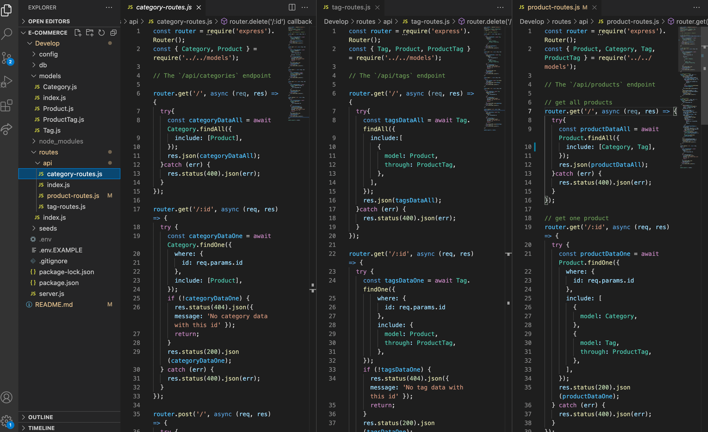
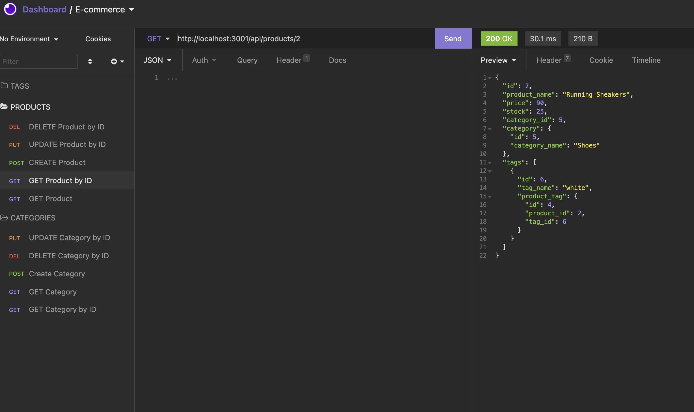

# E-Commerce

## Objective
This app is a back-end e-commerce site that stores, accesses and modifies a store's database of items. The application's routes are demonstrated using Insomnia Core.

## Technologies Used
Sequelize, Express, dotenv, Node.js, Javascript

## Links
* Repo: https://github.com/evapopp/E-Commerce
* Demo Video: https://watch.screencastify.com/v/ol5Uz9aWCSJEvTGDRcHn

## Page Preview

